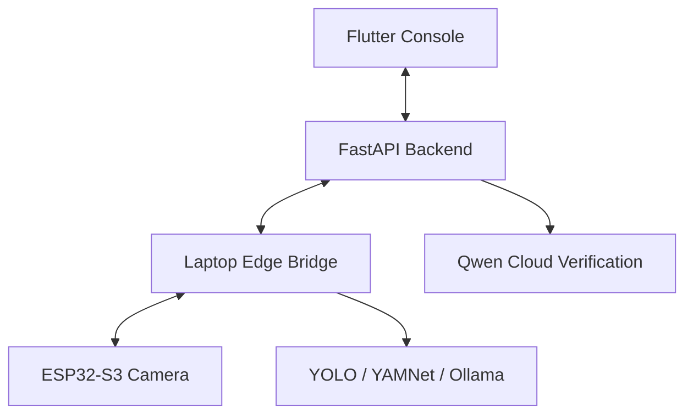

<div align="center">


### Qwen-powered agent cameras you configure in plain language.

*Describe what to watch for in plain English. The AI agent watches, triages, and verifies.*


[**Quickstart**](#-quickstart) · [**Architecture**](#️-architecture) · [**Docs**](#-documentation)

</div>

## 🎬 See it in action

<!-- Add demo asset at docs/assets/demo.gif (10-15s screen capture) -->


> No hardware? The backend ships a **zero-hardware demo mode** that plays video
> into a virtual camera and runs real Qwen-VL detection on it.

## What is Erlang AI Vision?

Erlang AI Vision is a full-stack AI camera platform. Define detection rules in
plain language ("alert me if a person is at the front door after 10pm"), and the
system compiles them into edge detector configs, runs local AI on the camera feed,
and escalates qualifying events to a cloud vision model for verification.

It spans three tiers:

| Tier | Repo | Role |
|------|------|------|
| **Cloud/App** | this repo | FastAPI backend + Flutter console: auth, agents, live video, verification |
| **Edge bridge** | `SentinelEdge_LaptopEdge` | Local YOLO/YAMNet detection + Ollama Qwen triage |
| **Camera** | `SentinelEdge_IOT` | ESP32-S3 firmware, QR provisioning, pan/tilt |

## ✨ Features

- 🗣️ **Natural-language agents** — describe a rule; Qwen Cloud compiles it to a detector config (keyword fallback, never fails).
- 💬 **Conversational agent builder** — draft and refine rules through chat, preview the compiled detector.
- 🎥 **Live video fan-out** — edge streams JPEG frames; clients view signed MJPEG/frame URLs.
- 🧠 **Two-stage AI** — local YOLO/Qwen triage on the edge, cloud Qwen-VL verification for high-value events.
- 🔍 **Audited verification tools** — the verifier can pan the camera, grab a snapshot, and read recent events — all logged.
- 🕹️ **Remote control** — pan / tilt / snapshot relayed over WebSocket.
- 🔔 **Realtime + push** — SSE for live updates, FCM for high-severity alerts.
- 🧪 **Zero-hardware demo mode** — simulate cameras from video files with real cloud detection.

## 🏗️ Architecture



> The backend never talks directly to a LAN camera. The edge bridge keeps an
> outbound connection open to the backend and relays commands to the camera.

<details>
<summary>Detailed data flow</summary>

```text
Erlang AI Vision Flutter console
  -> FastAPI backend (this repo)
      - auth/session/device/agent APIs
      - live MJPEG stream broker
      - edge command relay over WebSocket
      - event/media/alert persistence
      - Qwen Cloud verification + MCP-style tools
  <- Laptop edge bridge (SentinelEdge_LaptopEdge)
      - receives ESP32 frames/health/commands
      - runs YOLO/YAMNet/Ollama local pipeline
      - posts candidate events and media metadata
  <- ESP32 camera firmware (SentinelEdge_IOT)
      - captures JPEG frames
      - scans pairing QR for Wi-Fi + bridge address
      - drives pan/tilt servos
```

</details>

## 🚀 Quickstart

```powershell
# 1. Backend deps + env
pip install -r backend\requirements.txt
Copy-Item .env.example .env

# 2. Run backend + Flutter web together
.\scripts\start-dev.ps1
```

API docs: `http://localhost:8000/docs` · App: `http://localhost:8080`

**Try it with no hardware:**

```powershell
$env:PYTHONPATH="backend"
python scripts\create_judge_account.py     # seed demo login + cameras + agents
```

Set `DEMO_SIMULATION_ENABLED=true` and a `qwen-vl-*` model in `.env`, open a demo
camera's live view, and watch real events fire.

Full setup → [Backend setup](docs/backend/backend_setup.md) · [Frontend setup](docs/frontend/frontend_setup.md)

## 📚 Documentation

- [Backend architecture](docs/backend/architecture.md)
- [API endpoints](docs/backend/api_endpoints.md)
- [Edge integration](docs/backend/edge_integration.md)
- [Media storage](docs/backend/media_storage.md)
- [Deployment (Alibaba Cloud)](docs/deployment/alibaba_cloud_architecture.md)

**Related repos:** `SentinelEdge_LaptopEdge` (edge pipeline) · `SentinelEdge_IOT` (ESP32 firmware)

---
<div align="center">

Licensed under the [MIT License](LICENSE) · Built for the Erlang AI Vision hackathon.

</div>

<!--
  ASSETS: banner.png is wired in (save it under docs/assets/). Still optional:
  - demo.gif     10-15s     chat a rule -> live view -> event fires -> alert
-->
