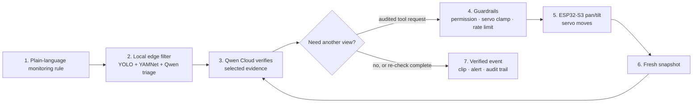

<div align="center">


### Qwen-powered agent cameras you configure in plain language.

*Describe what to watch for in plain English. The AI agent watches, triages, and verifies.*


[**Judge guide**](JUDGES.md) · [**Quickstart**](#-quickstart) · [**Architecture**](#️-architecture) · [**Build journey**](https://medium.com/@nicholasooi10/from-passive-cctv-to-intelligent-surveillance-agents-building-erlang-ai-vision-with-qwen-and-ffd1d16ebfb1?sharedUserId=nicholasooi10) · [**Docs**](#-documentation)

</div>

## 🏆 Qwen Cloud Global Hackathon

Submission for the **Qwen Cloud Global Hackathon — Track 5: EdgeAgent**.

### From motion alerts to investigated evidence

Most cameras detect movement but do not understand whether it matters. Repeated
generic alerts create alert fatigue, while cloud-first systems continuously
upload more footage than a useful decision requires.

With Erlang AI Vision, a user starts with one sentence:

> **“Alert me if Grandma falls in the living room.”**

The edge continuously runs video and audio perception locally. Only selected
candidate evidence reaches Qwen Cloud for contextual verification. When the
first view is inconclusive, Qwen can request a guarded pan/tilt adjustment and
a fresh snapshot before returning a verified alert with an explanation and
audit trail. Continuous footage stays on the local network; the cloud reasons
about moments that need it.

| | |
|---|---|
| **Live application** | [erlang-vision.duckdns.org](https://erlang-vision.duckdns.org) |
| **Android judge build** | [Download signed APK](https://github.com/nickyui99/erlang-ai-vision-fullstack/releases/download/v1.0.0-judge/app-release.apk) · [release notes](https://github.com/nickyui99/erlang-ai-vision-fullstack/releases/tag/v1.0.0-judge) |
| **Demo video** | [Watch on YouTube](https://www.youtube.com/watch?v=D-ClCQNNbQA) |
| **Build journey** | [From Passive CCTV to Intelligent Surveillance Agents](https://medium.com/@nicholasooi10/from-passive-cctv-to-intelligent-surveillance-agents-building-erlang-ai-vision-with-qwen-and-ffd1d16ebfb1?sharedUserId=nicholasooi10) |
| **Repositories** | [Fullstack](https://github.com/nickyui99/erlang-ai-vision-fullstack) (cloud + app, this repo) · [LaptopEdge](https://github.com/KennethChua1998/ErlangAIVision_LaptopEdge) (edge bridge) · [IOT](https://github.com/KennethChua1998/ErlangAIVision_IOT) (ESP32-S3 firmware) |
| **Deployment** | Alibaba Cloud `ap-southeast-3` (Kuala Lumpur): ECI container (FastAPI + Caddy), OSS (web app + media), RDS PostgreSQL, ACR — [deployment code proof](scripts/deployment/backend.ps1) · [architecture](docs/deployment/alibaba_cloud_architecture.md) |
| **Team** | Nicholas Ooi ([@nickyui99](https://github.com/nickyui99)) · Kenneth Chua ([@KennethChua1998](https://github.com/KennethChua1998)) · Fang Wei Lim · Ng Wei Kiat|

### Verify the live Alibaba Cloud backend

```bash
curl -fsS https://erlang-vision.duckdns.org/healthz
# {"data":{"status":"ok"}}

curl -fsS https://erlang-vision.duckdns.org/readyz
# {"data":{"status":"ready","database":"ok"}}
```

Both endpoints returned HTTP 200 when verified on July 20, 2026. They prove
that the production backend is reachable and its database dependency is ready.
The direct [deployment script](scripts/deployment/backend.ps1) demonstrates the
Alibaba Cloud ACR and ECI provisioning, while the
[cloud architecture](docs/deployment/alibaba_cloud_architecture.md) maps the
running service to ECI, RDS PostgreSQL, OSS, and ACR.

### ⚡ Judge proof in 60 seconds

1. Watch the [demo video](https://www.youtube.com/watch?v=D-ClCQNNbQA), then open the [live application](https://erlang-vision.duckdns.org).
2. Sign in with the judge account supplied privately in Devpost. The pre-seeded workspace includes cameras, armed agents, events, clips, and alerts—no hardware is required for this path.
3. Run the live health and readiness checks above, then inspect the direct [Alibaba Cloud deployment script](scripts/deployment/backend.ps1).
4. For the complete evidence map, expected outcomes, and three-repository layout, read the [judge guide](JUDGES.md).


*Recorded physical proof: the ESP32-S3 camera executes pan–tilt servo motion. In the deployed investigation flow, a Qwen-requested camera command is validated, clamped to safe movement limits, rate-limited, audited, and then relayed through the edge bridge.*

### Measured edge evidence

| Evidence | Result | Exact test setup |
|---|---:|---|
| **Local filtering bandwidth** | **106.99 MB → 1.30 MB** cloud-bound data (**98.8% lower**, about **83×**) | 180-second real LaptopEdge pipeline run on an AMD Ryzen 7 5800U, CPU-only, Windows 11. Simulated 640×480 JPEG camera at 15 FPS; 2,703 frames fed, 883 processed, 18 candidates, and 14 cloud escalations. The upstream byte count used an in-memory egress stub, so this is a pipeline measurement—not a universal WAN claim. |
| **Edge → cloud escalation** | **12.9 s p50** · **20.7 s p95** | Candidate detected → event escalated in the same CPU-only run. This includes local Qwen triage and routing, not only WAN latency. |
| **Qwen Cloud verification** | **2.47 s p50** · **2.59 s p95** | Five sequential real `qwen3.7-plus` image-verification calls to DashScope International on July 19, 2026, using one fixed 18,059-byte front-door JPEG, a fixed person-lingering rule, and `enable_thinking: false`. |
| **Approx. Qwen cost/event** | **US$0.00027** | 314 input + 73 output tokens for the measured call, using published International pricing and the documented exchange-rate assumption. |
| **False-positive reduction** | **Not yet measured** | The 18 → 14 filtering funnel is not a labelled false-positive rate; a labelled baseline is still required. |

Reproduce the local pipeline measurement with `python scripts/bench_pipeline.py --duration 180 --json results.json` in [LaptopEdge](https://github.com/KennethChua1998/ErlangAIVision_LaptopEdge); see its [full benchmark methodology](https://github.com/KennethChua1998/ErlangAIVision_LaptopEdge/blob/main/docs/BENCHMARKS.md).

### Investigation loop: rule → evidence → action → verification



The GIF above proves the physical servo step; the live demo and audit trail show the full guarded investigation loop.

### Qwen models used

| Model | Where it runs | What it does |
|---|---|---|
| `qwen3.7-plus` *(image verification)* | Qwen Cloud (DashScope) | Stage-3 multimodal event verification and guarded evidence requests. |
| `qwen3.7-max` *(chat + text)* | Qwen Cloud (DashScope) | MCP-connected assistant, natural-language rule compiler, and conversational agent builder. |
| `qwen3.5:0.8b` | **On the edge laptop** via Ollama | Stage-2 candidate-keyframe triage and final local vision fallback. |
| `qwen3.5:4b` | **On the edge laptop** via Ollama | Degraded-mode authority: an agentic tool-calling loop (pan, re-snapshot, re-assess) when the cloud is unreachable |

### Why Qwen is essential

The whole architecture is built around the Qwen family spanning **from a 0.8B
open-weight VLM on a CPU laptop to frontier cloud models** behind one prompt style:

1. **Plain language is the product** — user rules become detector configs through
   Qwen text models; there is no form-based rule editor.
2. **The edge filter needs a local VLM** — `qwen3.5:0.8b` triages every candidate
   frame on the laptop. In the documented 180-second edge benchmark, that cut
   cloud-bound bytes by **98.8%** (106.99 MB camera ingress → 1.30 MB cloud
   egress); see [Measured edge evidence](#measured-edge-evidence) for
   the scope and limits of that measurement.
3. **Verification needs vision + tools** — `qwen3.7-plus` doesn't just look at a
   keyframe; it can pan the camera, take a fresh snapshot, and check recent
   events through audited tool calls before ruling.
4. **Offline resilience needs the same brain smaller** — when the cloud is cut,
   `qwen3.5:4b` runs the *same kind* of agentic verification loop locally.

### Track 5 — EdgeAgent evidence

| Track requirement | Erlang AI Vision evidence |
|---|---|
| **Perceive at the edge** | The ESP32-S3 captures JPEG video and audio. The LaptopEdge bridge continuously runs YOLO and YAMNet, then uses local `qwen3.5:0.8b` to triage candidate evidence. |
| **Reason with Qwen Cloud** | `qwen3.7-plus` verifies ambiguous events; `qwen3.7-max` turns plain-language instructions into monitoring rules and powers the MCP-connected assistant. |
| **Act locally** | A cloud verifier can request a fresh snapshot or a safe pan/tilt adjustment. The backend validates the action, clamps movement, rate-limits it, and records the audit entry before the edge bridge relays it to the camera. |
| **Work under bandwidth and outage constraints** | Local filtering reduced cloud-bound bytes by 98.8% in the documented benchmark. Eligible events are queued for later cloud verification, while the local degraded-mode authority remains available when cloud access is lost. |
| **Handle privacy deliberately** | Continuous footage stays on the local network; only selected event evidence is escalated for cloud reasoning. All assistant tools are user-scoped and audited. |

### What the judge demo proves—and its boundaries

The hosted zero-hardware route uses server-side simulated cameras so judges can exercise the full detect → Qwen verify → event → alert flow without an ESP32. The application clearly labels degraded Qwen states rather than presenting a mock result as live verification. The physical-device route is documented in the companion [LaptopEdge](https://github.com/KennethChua1998/ErlangAIVision_LaptopEdge) and [IOT](https://github.com/KennethChua1998/ErlangAIVision_IOT) repositories; its ESP32-S3 camera, edge bridge, and pan–tilt command path are real hardware components.

### Built during the hackathon period (after May 26, 2026)

All three repositories were built from scratch during the hackathon window
(first commit June 11, 2026), including the cloud/app tier, edge pipeline,
ESP32-S3 firmware, Alibaba Cloud deployment, MCP tool server, and agentic
assistant. See `HACKATHON_SUBMISSION_CHECKLIST.md` and the git history for the
full development trail.

### 🧑‍⚖️ Judge testing details

Credentials, production and local testing paths, expected results, and the
three-repository evidence map are in the [Judge Guide](JUDGES.md). The
[Quickstart](#-quickstart) below covers a local zero-hardware run.

## ✨ Features

- 🗣️ **Natural-language agents** — describe a rule; Qwen Cloud compiles it to a detector config (keyword fallback, never fails).
- 💬 **Conversational agent builder** — draft and refine rules through chat, preview the compiled detector.
- 🤖 **Agentic AI assistant over MCP** — the in-app Erlang AI Agent connects to the platform's own MCP tool server and can inspect cameras, take snapshots, pan/tilt, query events, fetch clips, and create/arm agents for you ([details](#-mcp-tool-server)).
- 🎥 **Live video fan-out** — edge streams JPEG frames; clients view signed MJPEG/frame URLs.
- 🧠 **Two-stage AI** — local YOLO/Qwen triage on the edge, cloud Qwen-Plus verification for high-value events.
- 🔍 **Audited verification tools** — the verifier can pan the camera, grab a snapshot, and read recent events — all logged.
- 🕹️ **Remote control** — pan / tilt / snapshot relayed over WebSocket.
- 🔔 **Realtime + push** — SSE for live updates, FCM for high-severity alerts.
- 🧪 **Zero-hardware demo mode** — simulate cameras from video files with real cloud detection.

## 🏗️ Architecture


| Tier | Repo | Role |
|---|---|---|
| **Cloud/App** | this repo | FastAPI backend + Flutter console: auth, agents, live video, verification |
| **Edge bridge** | [`LaptopEdge`](https://github.com/KennethChua1998/ErlangAIVision_LaptopEdge) | Local YOLO/YAMNet detection + Ollama Qwen triage |
| **Camera** | [`IOT`](https://github.com/KennethChua1998/ErlangAIVision_IOT) | ESP32-S3 firmware, QR provisioning, pan/tilt |

> The backend never talks directly to a LAN camera. The edge bridge keeps an
> outbound connection open to the backend and relays commands to the camera.

<details>
<summary>Detailed data flow</summary>

```text
Erlang AI Vision Flutter console
  -> FastAPI backend (this repo)
      - auth/session/device/agent APIs
      - live MJPEG stream broker
      - edge command relay over WebSocket
      - event/media/alert persistence
      - Qwen Cloud verification + MCP-style tools
  <- Laptop edge bridge (ErlangAIVision_LaptopEdge)
      - receives ESP32 frames/health/commands
      - runs YOLO/YAMNet/Ollama local pipeline
      - posts candidate events and media metadata
  <- ESP32 camera firmware (ErlangAIVision_IOT)
      - captures JPEG frames
      - scans pairing QR for Wi-Fi + bridge address
      - drives pan/tilt servos
```

</details>

## 🔌 MCP tool server

The platform's tools are exposed as a standard **Model Context Protocol** server
(streamable HTTP) at `POST {API_PREFIX}/mcp/` — by default
`http://localhost:8000/api/v1/mcp/`. The in-app **Erlang AI Agent** chat connects
to it as an ordinary MCP client each turn, so anything it can do, any external
MCP client (Claude, IDEs, agent frameworks) can do too with a valid token.

**Tools** (all scoped to the authenticated user's own data):

| Group | Tools |
|---|---|
| Cameras | `list_devices`, `get_device_status`, `get_live_snapshot`, `pan_camera`, `tilt_camera` |
| Events & media | `query_events`, `get_event_clip`, `list_recordings` |
| Agents | `list_agents`, `create_agent`, `assign_agent`, `unassign_agent` |

**Auth**: requests carry `Authorization: Bearer <token>` where the token is a
short-lived signed `mcp_access` token minted by the backend (the chat service
mints one per turn; a user-facing token endpoint is on the roadmap for external
clients). Requests without a valid token are rejected before reaching the
protocol layer.

**Guardrails**: every call is permission-checked against a chat-scope autonomy
table (emergency escalation is denied), camera movement is clamped to
servo-safe ranges and rate-limited, every tool call is audited to `tool_audit`,
and chat turns are capped per account per day (`CHAT_DAILY_MESSAGE_LIMIT`,
default 50/day) since one agentic turn can spend several Qwen calls. If the
MCP server is unreachable, the chat degrades gracefully to text-only answers.

## 🚀 Quickstart

```powershell
# 1. Backend deps + env
pip install -r backend\requirements.txt
#    expected: ends with "Successfully installed ..." (no red ERROR lines)
Copy-Item .env.example .env

# 2. Initialize or upgrade the local SQLite schema
python -m alembic -c backend\alembic.ini upgrade head
#    expected: "Running upgrade ..." lines ending at the head revision, exit code 0

# 3. Run backend + Flutter web together
.\scripts\start-dev.ps1
#    expected: backend logs "Uvicorn running on http://0.0.0.0:8000",
#    Flutter logs "lib\main.dart is being served at http://localhost:8080"
```

API docs: `http://localhost:8000/docs` · App: `http://localhost:8080`
**Expected result:** the app loads at `localhost:8080` and `http://localhost:8000/healthz` returns `{"data":{"status":"ok"}}`.

**Try it with no hardware:**

```powershell
$env:PYTHONPATH="backend"
python scripts\create_judge_account.py     # seed demo login + cameras + agents
#    expected: ends with "=== judge demo account ready ===" and the login credentials

# data/demo_frames is generated locally and intentionally git-ignored.
# This uses the six sample clips committed under data/demo_videos/.
# OpenCV is required only for this generation step.
python -m pip install opencv-python
python scripts\extract_demo_frames.py --videos-dir
#    expected: writes JPEG sequences under data/demo_frames/<camera>/
```

Set `DEMO_SIMULATION_ENABLED=true` and a Qwen vision model in `.env`, then open a
demo camera's live view. The backend sends its first frame to Qwen after four
seconds and sends at most one more frame per minute.

Full setup → [Backend setup](docs/backend/backend_setup.md) · [Frontend setup](docs/frontend/frontend_setup.md)

## 📚 Documentation

- [Backend architecture](docs/backend/architecture.md)
- [API endpoints](docs/backend/api_endpoints.md)
- [Edge integration](docs/backend/edge_integration.md)
- [Media storage](docs/backend/media_storage.md)
- [Deployment (Alibaba Cloud)](docs/deployment/alibaba_cloud_architecture.md)

**Related repos:** [`ErlangAIVision_LaptopEdge`](https://github.com/KennethChua1998/ErlangAIVision_LaptopEdge) (edge pipeline) · [`ErlangAIVision_IOT`](https://github.com/KennethChua1998/ErlangAIVision_IOT) (ESP32 firmware)

---
<div align="center">

Licensed under the [MIT License](LICENSE) · [Third-party notices](THIRD_PARTY_NOTICES.md) · Built for the Erlang AI Vision hackathon.

</div>
