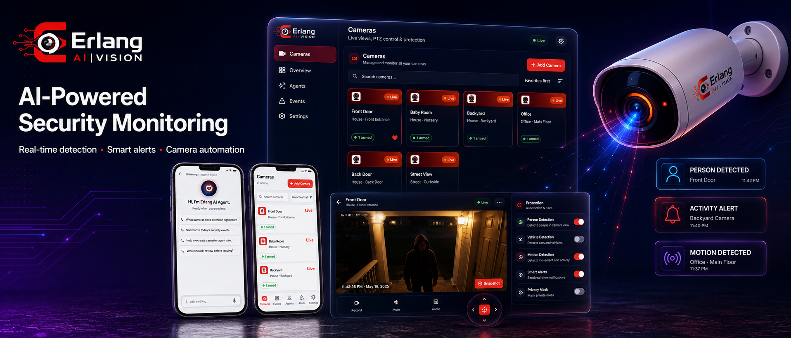
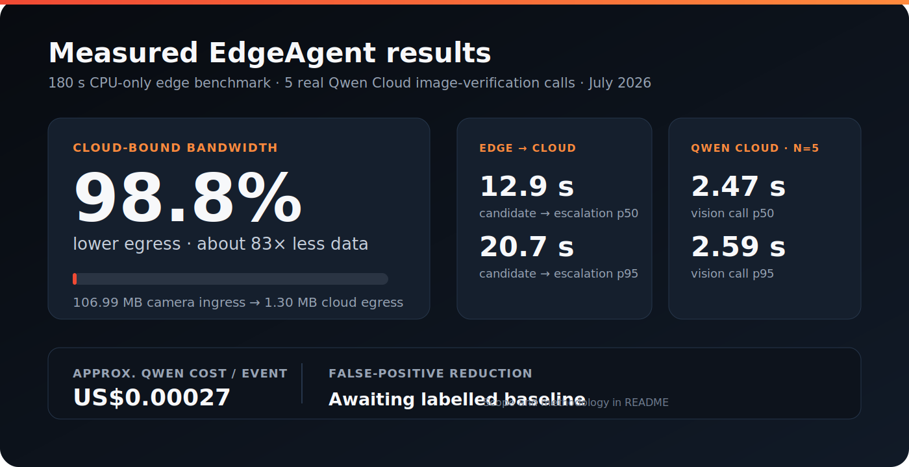
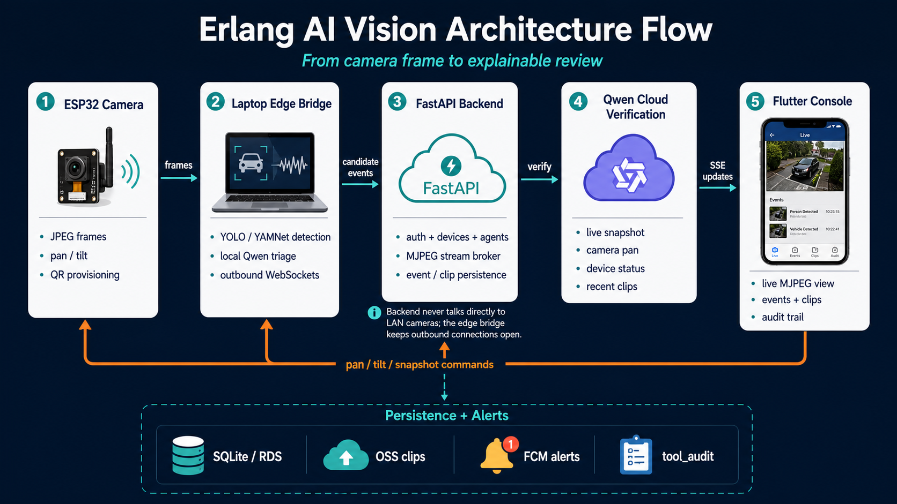
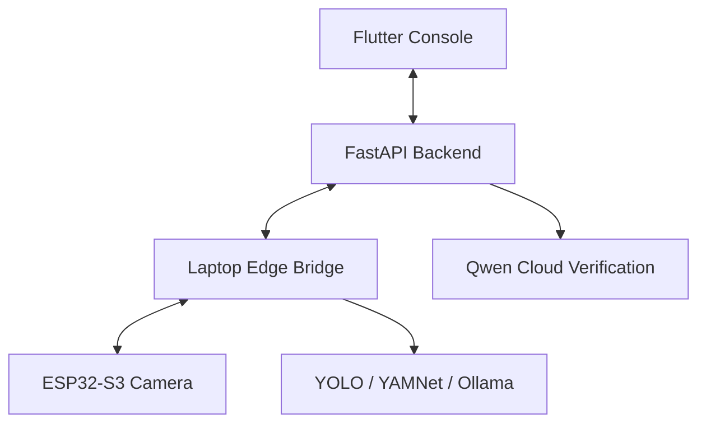

<div align="center">



### Qwen-powered agent cameras you configure in plain language.

*Describe what to watch for in plain English. The AI agent watches, triages, and verifies.*


[**Quickstart**](#-quickstart) · [**Architecture**](#️-architecture) · [**Docs**](#-documentation)

</div>

## 🏆 Qwen Cloud Global Hackathon

Submission for the **Qwen Cloud Global Hackathon — Track 5: EdgeAgent**.

| | |
|---|---|
| **Live application** | [erlang-vision.duckdns.org](https://erlang-vision.duckdns.org) |
| **Android judge build** | [Download signed APK](https://github.com/nickyui99/erlang-ai-vision-fullstack/releases/download/v1.0.0-judge/app-release.apk) · [release notes](https://github.com/nickyui99/erlang-ai-vision-fullstack/releases/tag/v1.0.0-judge) |
| **Demo video** | *coming before submission — will be linked here and on Devpost* |
| **Repositories** | [Fullstack](https://github.com/nickyui99/erlang-ai-vision-fullstack) (cloud + app, this repo) · [LaptopEdge](https://github.com/KennethChua1998/ErlangAIVision_LaptopEdge) (edge bridge) · [IOT](https://github.com/KennethChua1998/ErlangAIVision_IOT) (ESP32-S3 firmware) |
| **Deployment** | Alibaba Cloud `ap-southeast-3` (Kuala Lumpur): ECI container (FastAPI + Caddy), OSS (web app + media), RDS PostgreSQL, ACR — [deployment code proof](scripts/deployment/backend.ps1) · [architecture](docs/deployment/alibaba_cloud_architecture.md) |
| **Team** | Nicholas Ooi ([@nickyui99](https://github.com/nickyui99)) · Kenneth Chua ([@KennethChua1998](https://github.com/KennethChua1998)) · Fang Wei Lim · Ng Wei Kiat|

### Qwen models used

| Model | Where it runs | What it does |
|---|---|---|
| `qwen3.7-plus` *(image verification)* | Qwen Cloud (DashScope) | Stage-3 event verification (vision + tool calling) — per-event image work runs on the plus tier to keep costs down (falls back to `qwen3.7-plus-2026-05-26`) |
| `qwen3.7-max` *(chat + text)* | Qwen Cloud (DashScope) | The agentic in-app assistant (Erlang AI Agent), NL-rule compiler, and conversational agent builder (falls back through `qwen3.7-max-2026-05-20` → `qwen3.7-max-preview` → `qwen3.7-max-2026-05-17` → `qwen3.7-max-2026-06-08`) |
| `qwen3.5:0.8b` | **On the edge laptop** via Ollama | Stage-2 triage: judges every candidate keyframe against the user's rule, locally (also the final vision fallback when every cloud model is exhausted) |
| `qwen3.5:4b` | **On the edge laptop** via Ollama | Degraded-mode authority: an agentic tool-calling loop (pan, re-snapshot, re-assess) when the cloud is unreachable |

### Why Qwen is essential

The whole architecture is built around the Qwen family spanning **from a 0.8B
open-weight VLM on a CPU laptop to frontier cloud models** behind one prompt style:

1. **Plain language is the product** — user rules become detector configs through
   Qwen text models; there is no form-based rule editor.
2. **The edge filter needs a local VLM** — `qwen3.5:0.8b` triages every candidate
   frame on the laptop. In the documented 180-second edge benchmark, that cut
   cloud-bound bytes by **98.8%** (106.99 MB camera ingress → 1.30 MB cloud
   egress); see [Measured EdgeAgent results](#-measured-edgeagent-results) for
   the scope and limits of that measurement.
3. **Verification needs vision + tools** — `qwen3.7-plus` doesn't just look at a
   keyframe; it can pan the camera, take a fresh snapshot, and check recent
   events through audited tool calls before ruling.
4. **Offline resilience needs the same brain smaller** — when the cloud is cut,
   `qwen3.5:4b` runs the *same kind* of agentic verification loop locally.

### Built during the hackathon period (after May 26, 2026)

All three repositories were built from scratch during the hackathon window
(first commit June 11, 2026): the FastAPI backend and Flutter console, the
laptop edge pipeline (YOLO/YAMNet + Ollama Qwen triage, offline queue, degraded
mode), the ESP32-S3 firmware with QR provisioning and pan/tilt, the Alibaba
Cloud deployment, and — in the final week — the MCP tool server with the
agentic in-app assistant, on-demand recording, instant agent arm/disarm, and
browser-playable (H.264) event clips. See `HACKATHON_SUBMISSION_CHECKLIST.md`
and the git history for the full trail.

### 🧑‍⚖️ Judge testing instructions
1. **Android option:** [download the signed judge APK](https://github.com/nickyui99/erlang-ai-vision-fullstack/releases/download/v1.0.0-judge/app-release.apk), install it, then use the same judge credentials below. The browser console remains available at the [live application](https://erlang-vision.duckdns.org).

2. **Sign in** at the live application URL with the judge credentials provided
   on Devpost (the account is pre-verified — no email confirmation needed).
3. The dashboard is **pre-seeded**: cameras for each use case, armed agents, and
   sample events, so there is something to explore immediately.
4. **Zero-hardware demo**: judge cameras are simulated server-side — the backend
   streams pre-extracted frames into the live view and runs *real* Qwen-Plus
   detection on them, so the full detect → verify → alert flow works with no
   physical device.
5. Things to try:
   - Create an agent in plain English (e.g. *"alert me if a person lingers at
     the door after 9pm"*) and inspect the compiled detector config.
   - Open the **Erlang AI Agent** chat and ask *"which cameras do I have and
     are any agents armed?"* — it answers from live data via MCP tools, and can
     arm agents or take snapshots for you.
   - Open an event and play its clip; check the audited tool calls on verified
     events.
6. To run everything locally instead (including the physical-device path), see
   the [Quickstart](#-quickstart) below.

**Expected result:** the dashboard loads over HTTPS, a demo camera shows live
frames, and a qualifying rule produces an event with a Qwen verification result
and an in-app alert. If a live-Qwen dependency is unavailable, the UI reports
the degraded state rather than presenting a mock result as live verification.

### Expected outcomes by demo path

| Path | Start here | Expected result |
|---|---|---|
| **Production judge demo** | Sign in at the [live application](https://erlang-vision.duckdns.org) with the Devpost judge account. | The pre-seeded dashboard and demo cameras load over HTTPS; live frames, verified events, clips, and in-app alerts are available without physical hardware. |
| **Local no-hardware demo** | Follow the [Quickstart](#-quickstart), create the judge account, and enable `DEMO_SIMULATION_ENABLED=true`. | The backend creates the demo account, publishes simulated frames, and submits the first eligible frame to Qwen after four seconds. |
| **Physical device path** | Complete the LaptopEdge and ESP32-S3 setup in the linked companion repositories. | The bridge reports `device listener ready` and `backend websocket connected`; the dashboard receives live frames and an armed agent can create an event and alert. |

## 📊 Measured EdgeAgent results



| Measure | Result | Measurement context |
|---|---:|---|
| **Edge → cloud escalation** | **12.9 s p50** · **20.7 s p95** | Candidate detected → event escalated during a 180-second CPU-only LaptopEdge run (18 candidates; 14 cloud escalations). This includes local triage and routing; it is not a dedicated production-WAN latency test. |
| **Qwen Cloud verification** | **2.47 s p50** · **2.59 s p95** | Five sequential real `qwen3.7-plus` image-verification calls to the DashScope International endpoint on July 19, 2026; one 18 KB JPEG and a fixed rule prompt per call. |
| **Cloud-bound bandwidth** | **98.8% lower** (about **83×**) | Same 180-second edge run: 106.99 MB camera ingress vs. 1.30 MB cloud egress (2,703 frames captured; local stages selected 14 cloud escalations). |
| **False-positive reduction** | **Not yet measured** | The 18 → 14 local filtering funnel is not a labelled false-positive rate. A threshold-only, labelled baseline is still required before claiming a reduction. |
| **Approx. Qwen cost / event** | **US$0.00027** | 314 input + 73 output tokens per sampled call × `qwen3.7-plus` International 0–256K token pricing, converted at 6.7758 CNY/USD. Excludes any account-specific discount, taxes, or later pricing changes. |

**Reproducibility notes.** The edge benchmark ran for 180 seconds on an AMD Ryzen 7 5800U CPU-only laptop with a simulated camera. It processed 883 frames (4.9 FPS), with 18 Stage-1 candidates; local Qwen triage resolved 4 and escalated 14. Its byte accounting uses a cloud-egress stub, so the reported reduction is a pipeline measurement, not a claim about every deployment's WAN throughput. The live-cloud sample used the same 18,059-byte bundled front-door JPEG, a fixed person-lingering rule, and `enable_thinking: false`. The USD estimate uses the June 2026 monthly 6.7758 CNY/USD rate. See the [edge benchmark report](https://github.com/KennethChua1998/ErlangAIVision_LaptopEdge/blob/main/docs/BENCHMARKS.md), [DashScope model pricing](https://help.aliyun.com/en/model-studio/model-pricing), and [Federal Reserve exchange-rate series](https://fred.stlouisfed.org/series/EXCHUS).

## 🎬 See it in action




> No hardware? The backend ships a **zero-hardware demo mode** that plays video
> into a virtual camera and runs real Qwen-Plus detection on it.

## What is Erlang AI Vision?

Erlang AI Vision is a full-stack AI camera platform. Define detection rules in
plain language ("alert me if a person is at the front door after 10pm"), and the
system compiles them into edge detector configs, runs local AI on the camera feed,
and escalates qualifying events to a cloud vision model for verification.

It spans three tiers:

| Tier | Repo | Role |
|------|------|------|
| **Cloud/App** | this repo | FastAPI backend + Flutter console: auth, agents, live video, verification |
| **Edge bridge** | [`LaptopEdge`](https://github.com/KennethChua1998/ErlangAIVision_LaptopEdge) | Local YOLO/YAMNet detection + Ollama Qwen triage |
| **Camera** | [`IOT`](https://github.com/KennethChua1998/ErlangAIVision_IOT) | ESP32-S3 firmware, QR provisioning, pan/tilt |

## ✨ Features

- 🗣️ **Natural-language agents** — describe a rule; Qwen Cloud compiles it to a detector config (keyword fallback, never fails).
- 💬 **Conversational agent builder** — draft and refine rules through chat, preview the compiled detector.
- 🤖 **Agentic AI assistant over MCP** — the in-app Erlang AI Agent connects to the platform's own MCP tool server and can inspect cameras, take snapshots, pan/tilt, query events, fetch clips, and create/arm agents for you ([details](#-mcp-tool-server)).
- 🎥 **Live video fan-out** — edge streams JPEG frames; clients view signed MJPEG/frame URLs.
- 🧠 **Two-stage AI** — local YOLO/Qwen triage on the edge, cloud Qwen-Plus verification for high-value events.
- 🔍 **Audited verification tools** — the verifier can pan the camera, grab a snapshot, and read recent events — all logged.
- 🕹️ **Remote control** — pan / tilt / snapshot relayed over WebSocket.
- 🔔 **Realtime + push** — SSE for live updates, FCM for high-severity alerts.
- 🧪 **Zero-hardware demo mode** — simulate cameras from video files with real cloud detection.

## 🏗️ Architecture



> The backend never talks directly to a LAN camera. The edge bridge keeps an
> outbound connection open to the backend and relays commands to the camera.

<details>
<summary>Detailed data flow</summary>

```text
Erlang AI Vision Flutter console
  -> FastAPI backend (this repo)
      - auth/session/device/agent APIs
      - live MJPEG stream broker
      - edge command relay over WebSocket
      - event/media/alert persistence
      - Qwen Cloud verification + MCP-style tools
  <- Laptop edge bridge (ErlangAIVision_LaptopEdge)
      - receives ESP32 frames/health/commands
      - runs YOLO/YAMNet/Ollama local pipeline
      - posts candidate events and media metadata
  <- ESP32 camera firmware (ErlangAIVision_IOT)
      - captures JPEG frames
      - scans pairing QR for Wi-Fi + bridge address
      - drives pan/tilt servos
```

</details>

## 🔌 MCP tool server

The platform's tools are exposed as a standard **Model Context Protocol** server
(streamable HTTP) at `POST {API_PREFIX}/mcp/` — by default
`http://localhost:8000/api/v1/mcp/`. The in-app **Erlang AI Agent** chat connects
to it as an ordinary MCP client each turn, so anything it can do, any external
MCP client (Claude, IDEs, agent frameworks) can do too with a valid token.

**Tools** (all scoped to the authenticated user's own data):

| Group | Tools |
|---|---|
| Cameras | `list_devices`, `get_device_status`, `get_live_snapshot`, `pan_camera`, `tilt_camera` |
| Events & media | `query_events`, `get_event_clip`, `list_recordings` |
| Agents | `list_agents`, `create_agent`, `assign_agent`, `unassign_agent` |

**Auth**: requests carry `Authorization: Bearer <token>` where the token is a
short-lived signed `mcp_access` token minted by the backend (the chat service
mints one per turn; a user-facing token endpoint is on the roadmap for external
clients). Requests without a valid token are rejected before reaching the
protocol layer.

**Guardrails**: every call is permission-checked against a chat-scope autonomy
table (emergency escalation is denied), camera movement is clamped to
servo-safe ranges and rate-limited, every tool call is audited to `tool_audit`,
and chat turns are capped per account per day (`CHAT_DAILY_MESSAGE_LIMIT`,
default 50/day) since one agentic turn can spend several Qwen calls. If the
MCP server is unreachable, the chat degrades gracefully to text-only answers.

## 🚀 Quickstart

```powershell
# 1. Backend deps + env
pip install -r backend\requirements.txt
#    expected: ends with "Successfully installed ..." (no red ERROR lines)
Copy-Item .env.example .env

# 2. Initialize or upgrade the local SQLite schema
python -m alembic -c backend\alembic.ini upgrade head
#    expected: "Running upgrade ..." lines ending at the head revision, exit code 0

# 3. Run backend + Flutter web together
.\scripts\start-dev.ps1
#    expected: backend logs "Uvicorn running on http://0.0.0.0:8000",
#    Flutter logs "lib\main.dart is being served at http://localhost:8080"
```

API docs: `http://localhost:8000/docs` · App: `http://localhost:8080`
**Expected result:** the app loads at `localhost:8080` and `http://localhost:8000/healthz` returns `{"data":{"status":"ok"}}`.

**Try it with no hardware:**

```powershell
$env:PYTHONPATH="backend"
python scripts\create_judge_account.py     # seed demo login + cameras + agents
#    expected: ends with "=== judge demo account ready ===" and the login credentials

# data/demo_frames is generated locally and intentionally git-ignored.
# This uses the six sample clips committed under data/demo_videos/.
# OpenCV is required only for this generation step.
python -m pip install opencv-python
python scripts\extract_demo_frames.py --videos-dir
#    expected: writes JPEG sequences under data/demo_frames/<camera>/
```

Set `DEMO_SIMULATION_ENABLED=true` and a Qwen vision model in `.env`, then open a
demo camera's live view. The backend sends its first frame to Qwen after four
seconds and sends at most one more frame per minute.

Full setup → [Backend setup](docs/backend/backend_setup.md) · [Frontend setup](docs/frontend/frontend_setup.md)

## 📚 Documentation

- [Backend architecture](docs/backend/architecture.md)
- [API endpoints](docs/backend/api_endpoints.md)
- [Edge integration](docs/backend/edge_integration.md)
- [Media storage](docs/backend/media_storage.md)
- [Deployment (Alibaba Cloud)](docs/deployment/alibaba_cloud_architecture.md)

**Related repos:** [`ErlangAIVision_LaptopEdge`](https://github.com/KennethChua1998/ErlangAIVision_LaptopEdge) (edge pipeline) · [`ErlangAIVision_IOT`](https://github.com/KennethChua1998/ErlangAIVision_IOT) (ESP32 firmware)

---
<div align="center">

Licensed under the [MIT License](LICENSE) · [Third-party notices](THIRD_PARTY_NOTICES.md) · Built for the Erlang AI Vision hackathon.

</div>
