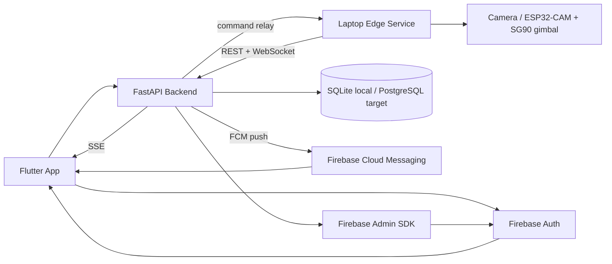
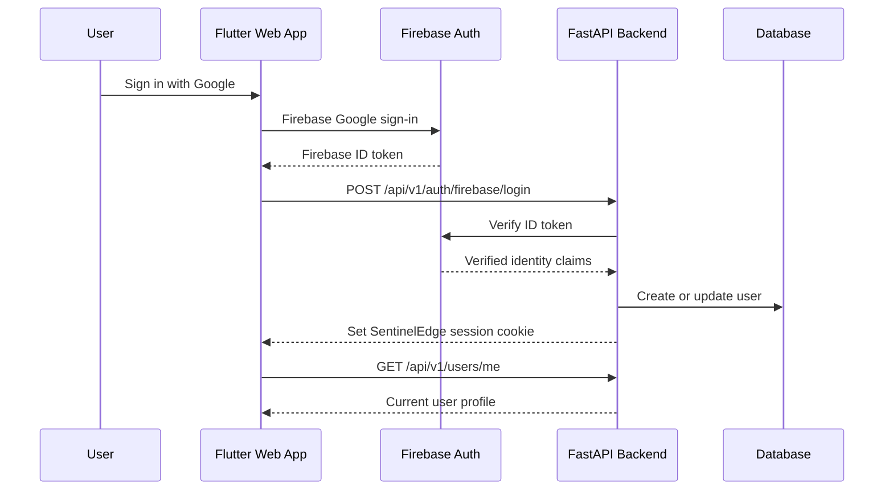
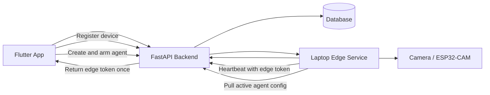
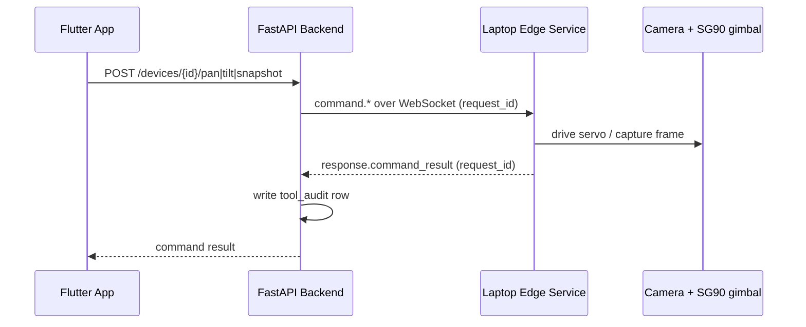
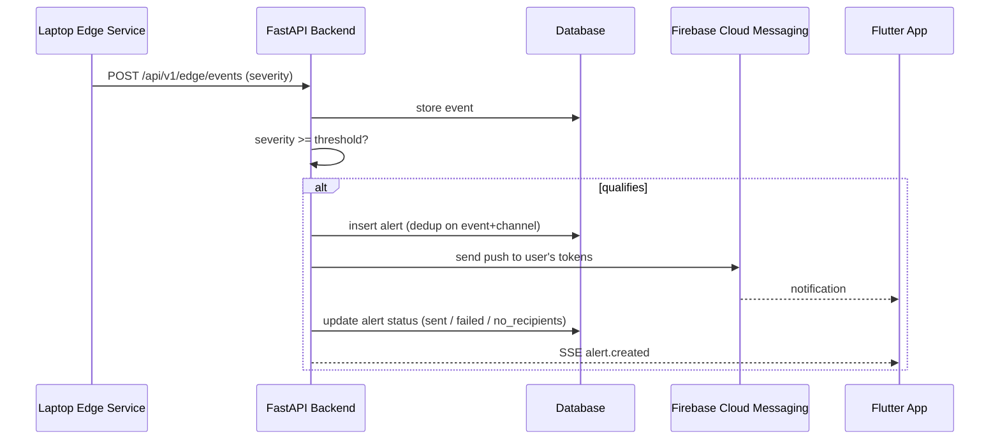

# SentinelEdge Architecture

This document gives a high-level view of the current MVP architecture: auth, the device/agent loop, edge command relay, and push alerts.

## Current MVP Architecture

## Authentication Flow

## Device and Agent Loop

## Edge Command Relay

User-initiated camera commands are relayed to the edge service over the
WebSocket channel, never sent directly to the camera. Pan and tilt drive the
two SG90 servos of the gimbal (each `0–180°`, centered at `90°`); snapshot
requests a fresh frame. Every command is audit-logged in `tool_audit`.

## Alert Flow (Milestone 8 — Firebase Cloud Messaging)

When the edge submits an event whose severity is at or above
`ALERT_MIN_SEVERITY` (default `high`), the backend creates a deduplicated alert,
pushes it to every FCM token the owner has registered, stores the delivery
result, and emits `alert.created` over SSE. Delivery is best-effort and never
blocks event ingestion.

Clients register an FCM registration token with
`POST /api/v1/notifications/tokens` and remove it on logout with
`DELETE /api/v1/notifications/tokens/{token}`. FCM reuses the same Firebase
Admin SDK and service-account credentials configured for auth.
