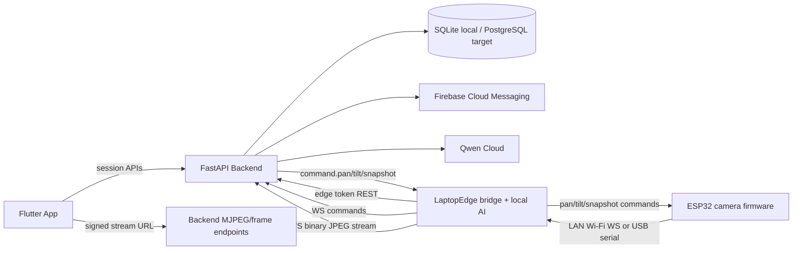
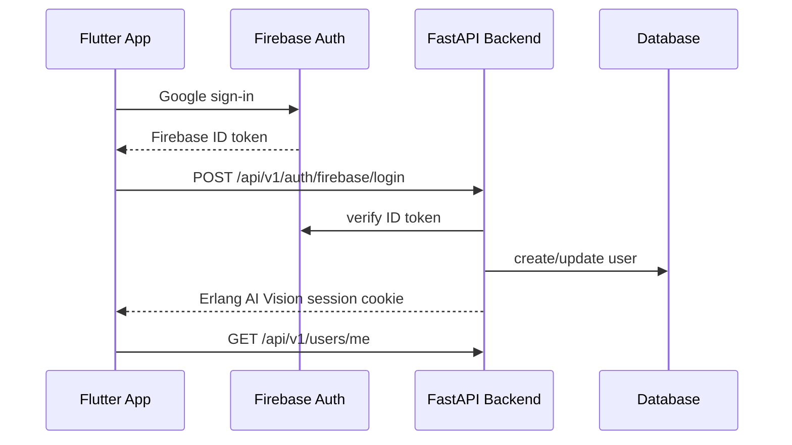
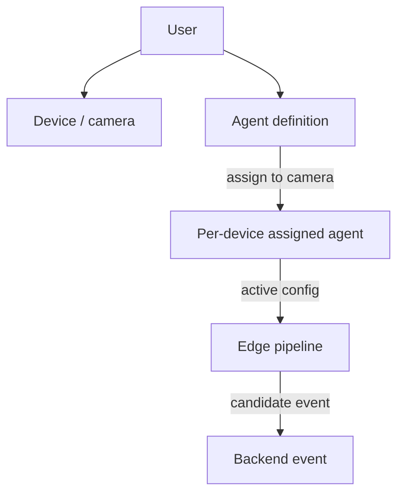
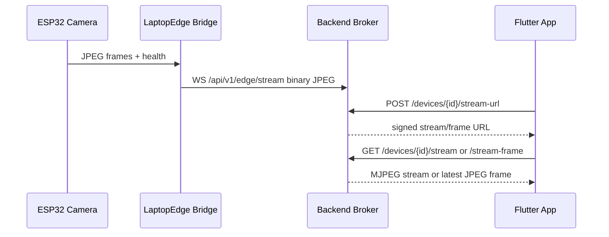
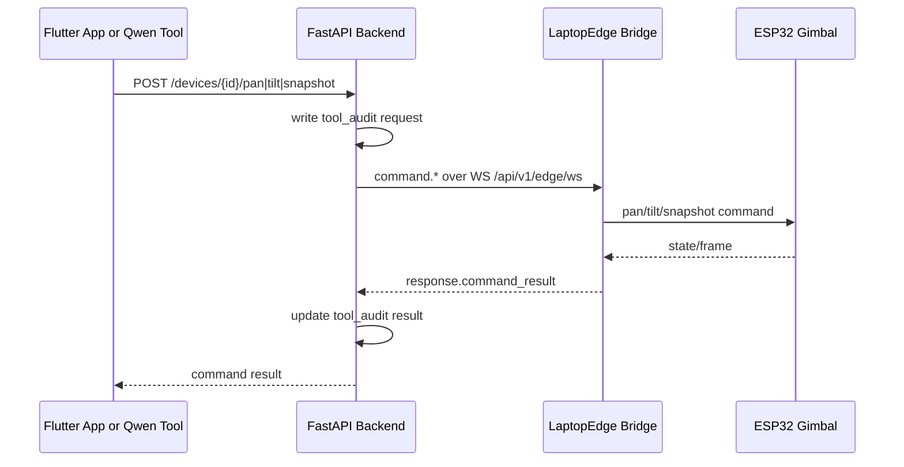
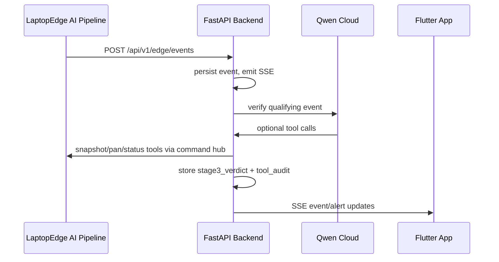

# Erlang AI Vision Backend Architecture

This document describes the current backend architecture in `erlang-ai-vision-fullstack` and how it connects to the sibling edge repositories.

## Scope

This repo owns:

- FastAPI HTTP/WebSocket API.
- Firebase login and backend session cookies.
- Device, agent, event, clip, recording, alert, and tool-audit persistence.
- Live JPEG stream fan-out to web clients.
- Command relay between the app/Qwen tools and the edge bridge.
- Qwen Cloud verification for events posted by the edge tier.
- Flutter app UI for camera management, live view, rules, PTZ controls, and event review.

This repo does not own the camera firmware or local detection runtime:

- `SentinelEdge_IOT` owns ESP32 firmware, QR provisioning, Wi-Fi/USB transport, camera capture, and servo control.
- `SentinelEdge_LaptopEdge` owns the local bridge and AI pipeline: YOLO video detection, optional YAMNet audio detection, Ollama Qwen local triage, event posting, and local preview.

## System View

## Authentication

User-facing APIs use the backend session cookie. Edge APIs use a device-bound edge token in `Authorization: Bearer <edge_token>`.

## Device and Agent Model

Agents are now definition-first. Creating an agent can leave `device_id` null. Assigning an agent to a camera creates a per-device sub-agent with `parent_agent_id`, `device_id`, state `armed`, and a compiled edge config. Unassigning deletes that sub-agent.

Rules are compiled by `app/agents/compiler.py` using a Qwen Cloud text model (`QWEN_COMPILER_MODEL`, default `qwen-plus`), producing the edge `compiled_edge_config` (`classes`, `min_confidence`, `dwell_s`, `cooldown_s`, optional `schedule`/`roi`) plus a `compiled_prompt`. It falls back to a deterministic keyword compiler in test/key-less environments or on any error, so agent creation never fails. Users can also draft rules conversationally via the agent builder (`app/agents/builder.py`, `POST /api/v1/agents/builder`).

## Demo Simulation

For demos without hardware, `app/services/demo_simulator.py` drives a camera server-side: it loops pre-extracted frames into the video broker (on-demand while a viewer watches) and periodically sends a keyframe to the Qwen-Plus API to triage against the camera's rule, creating real events. It is strictly gated — active only when `DEMO_SIMULATION_ENABLED=true`, the `device_id` starts with `DEMO_SIM_DEVICE_PREFIX` (default `dev_judge_`), and a frame folder exists (`DEMO_FRAMES_DIR`). Normal accounts are unaffected. See the README "Demo Simulation & Judge Account" section.

## Live Video Flow

The backend broker is in-memory. It keeps only the latest frame per device and fans frames out to active subscribers. The signed stream token is used because browser image requests cannot attach custom auth headers.

## Command Relay

Pan accepts `0..180`. Tilt accepts `60..140`, matching the mechanical safe range of the current rig. The device reports `current_pan` and `current_tilt` through heartbeat.

## Event and Verification Flow

The local LaptopEdge pipeline does Stage 1/2 detection and triage before posting events. The backend Stage 3 verifier is optional and controlled by `VERIFICATION_ENABLED` / `QWEN_API_KEY`.

## Realtime and Alerts

The backend emits SSE at `GET /api/v1/stream/events` for user-visible changes such as device health, events, clips, and alerts. High-severity events create alert records and trigger Firebase Cloud Messaging when push tokens are registered.

## Storage

Local development uses SQLite through async SQLAlchemy. Production targets PostgreSQL-compatible relational storage. Media bytes are not stored in the relational database; clip/recording rows hold metadata and local/OSS paths. The media URL service generates signed Alibaba OSS upload, playback, and download URLs when OSS credentials are configured; local/offline tests intentionally fall back to `placeholder://` URLs.
