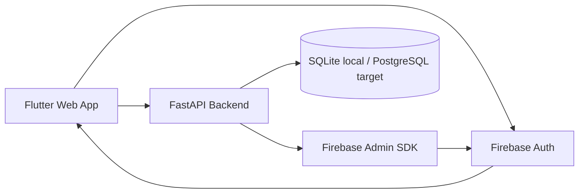
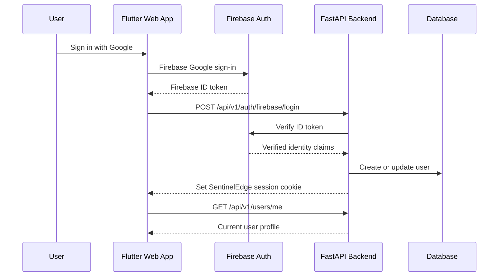
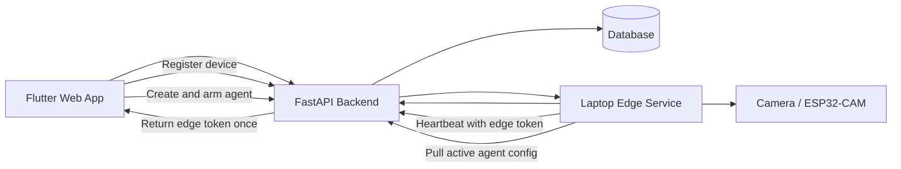

# SentinelEdge Architecture

This document gives a high-level view of the current MVP architecture and the next device/agent loop.

## Current MVP Architecture

## Authentication Flow

## Milestone 4 Target Loop

