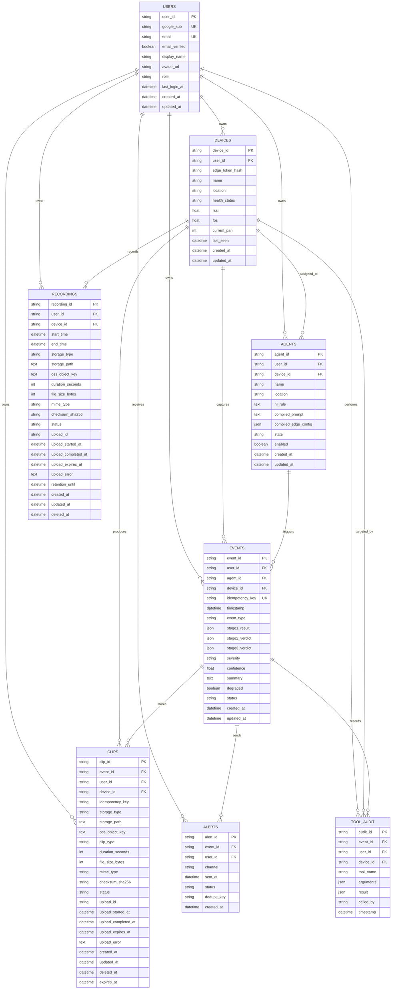

# SentinelEdge Database ERD

## Notes

- `USERS.google_sub` is the stable Google OAuth identity key.
- `USERS.password_hash` is intentionally omitted because user login is handled by Google OAuth.
- `DEVICES.edge_token_hash` stores a hashed device token for edge authentication.
- `EVENTS.idempotency_key` supports duplicate-safe event ingestion from the edge tier.
- Raw video bytes are not stored in the database. `CLIPS` and `RECORDINGS` store metadata and storage references only.

## Field Descriptions

### USERS

| Field | Description |
|---|---|
| `user_id` | Internal primary key for the SentinelEdge user. |
| `google_sub` | Stable unique user identifier from Google OAuth/OpenID Connect. |
| `email` | User email from Google profile. Useful for display and account lookup, but not the primary identity key. |
| `email_verified` | Whether Google reports the email as verified. |
| `display_name` | User-facing name from Google profile. |
| `avatar_url` | Profile image URL from Google profile. |
| `role` | Application role, such as `user` or `admin`. |
| `last_login_at` | Last successful Google OAuth login time. |
| `created_at` | Time the local user row was created. |
| `updated_at` | Time the local user row was last updated. |

### DEVICES

| Field | Description |
|---|---|
| `device_id` | Internal primary key for a camera, laptop edge node, or logical camera device. |
| `user_id` | Owner of the device. Derived from the logged-in user during registration. |
| `edge_token_hash` | Hash of the device token used by the edge service to authenticate API calls. Store only the hash, not the raw token. |
| `name` | User-defined device name, such as `Front Door Camera`. |
| `location` | User-defined physical or logical location. |
| `health_status` | Current health state, such as `online`, `offline`, `degraded`, or `unknown`. |
| `rssi` | Latest signal strength reported by the device or edge service, if available. |
| `fps` | Latest measured frames per second from the camera stream. |
| `current_pan` | Current servo pan angle, usually clamped between 0 and 180. |
| `last_seen` | Last heartbeat or successful contact time from the device/edge service. |
| `created_at` | Time the device was registered. |
| `updated_at` | Time the device row was last updated. |

### AGENTS

| Field | Description |
|---|---|
| `agent_id` | Internal primary key for a surveillance agent. |
| `user_id` | Owner of the agent. |
| `device_id` | Device this agent watches or controls. |
| `name` | User-defined agent name. |
| `location` | Optional agent-specific location label. |
| `nl_rule` | Natural-language rule written by the user. |
| `compiled_prompt` | Backend-generated prompt used for AI verification or agent reasoning. |
| `compiled_edge_config` | JSON configuration sent to the edge service for local detection behavior. |
| `state` | Agent state, such as `armed`, `disarmed`, or `paused`. |
| `enabled` | Whether the agent is active and eligible to run. |
| `created_at` | Time the agent was created. |
| `updated_at` | Time the agent was last updated. |

### EVENTS

| Field | Description |
|---|---|
| `event_id` | Primary key for a detected or verified event. Can be generated by the edge or backend. |
| `user_id` | Owner of the event, derived from the authenticated device or related agent. |
| `agent_id` | Agent that triggered or owns the event. |
| `device_id` | Device that captured the event. |
| `idempotency_key` | Retry-safe key from the edge service to prevent duplicate event rows. Prefer a unique constraint on `(device_id, idempotency_key)`. |
| `timestamp` | Time the event occurred at the edge. |
| `event_type` | Event category, such as `person_detected`, `motion`, or `vehicle_detected`. |
| `stage1_result` | JSON output from the first local detector stage. |
| `stage2_verdict` | JSON output from the second local verification stage. |
| `stage3_verdict` | JSON output from cloud verification, such as Qwen. |
| `severity` | Event severity, such as `low`, `medium`, `high`, or `critical`. |
| `confidence` | Confidence score for the event or final verdict. |
| `summary` | Human-readable event summary. |
| `degraded` | Whether the event was processed with reduced confidence due to failures or missing data. |
| `status` | Lifecycle state, such as `candidate`, `cloud_pending`, `verified`, `alerted`, `dismissed`, or `false_positive`. |
| `created_at` | Time the backend stored the event. |
| `updated_at` | Time the event row was last updated. |

### CLIPS

| Field | Description |
|---|---|
| `clip_id` | Primary key for an event clip or thumbnail-related clip record. |
| `event_id` | Event this clip belongs to. |
| `user_id` | Owner of the clip. Should match the related event owner. |
| `device_id` | Device that produced the clip. |
| `idempotency_key` | Optional retry-safe key to prevent duplicate clip metadata rows when the edge retries upload registration. |
| `storage_type` | Where the clip lives, such as `local_edge`, `oss`, or `pending_upload`. |
| `storage_path` | Local edge-relative path or logical storage reference. Do not store unsafe absolute paths unless intentionally required. |
| `oss_object_key` | Alibaba OSS object key when the clip is uploaded to OSS. |
| `clip_type` | Clip category, such as `event`, `thumbnail`, `pre_roll`, or `post_roll`. |
| `duration_seconds` | Clip duration in seconds. |
| `file_size_bytes` | Clip file size in bytes. |
| `mime_type` | Media MIME type, such as `video/mp4` or `image/jpeg`. |
| `checksum_sha256` | SHA-256 checksum for integrity verification, if available. |
| `status` | Clip lifecycle state, such as `pending_upload`, `uploading`, `available`, `failed`, or `deleted`. |
| `upload_id` | Provider or backend upload session identifier for direct-to-OSS upload flows. |
| `upload_started_at` | Time the upload session was created or started. |
| `upload_completed_at` | Time the upload was confirmed complete. |
| `upload_expires_at` | Expiration time for the upload URL/session. |
| `upload_error` | Last upload failure message or diagnostic detail. |
| `created_at` | Time the clip metadata row was created. |
| `updated_at` | Time the clip metadata row was last updated. |
| `deleted_at` | Soft-delete timestamp. Playback should be blocked when this is set. |
| `expires_at` | Time after which the clip should be deleted or no longer accessible. |

### RECORDINGS

| Field | Description |
|---|---|
| `recording_id` | Primary key for a continuous or scheduled recording segment. |
| `user_id` | Owner of the recording. |
| `device_id` | Device that produced the recording. |
| `start_time` | Recording segment start time. |
| `end_time` | Recording segment end time. |
| `storage_type` | Where the recording lives, such as `local_edge`, `oss`, or `pending_upload`. |
| `storage_path` | Local edge-relative path or logical storage reference. |
| `oss_object_key` | Alibaba OSS object key when uploaded. |
| `duration_seconds` | Recording duration in seconds. |
| `file_size_bytes` | Recording file size in bytes. |
| `mime_type` | Media MIME type, usually `video/mp4`. |
| `checksum_sha256` | SHA-256 checksum for integrity verification, if available. |
| `status` | Recording lifecycle state, such as `local_only`, `pending_upload`, `available`, `failed`, or `deleted`. |
| `upload_id` | Provider or backend upload session identifier for upload flows. |
| `upload_started_at` | Time the upload session was created or started. |
| `upload_completed_at` | Time the upload was confirmed complete. |
| `upload_expires_at` | Expiration time for the upload URL/session. |
| `upload_error` | Last upload failure message or diagnostic detail. |
| `retention_until` | Time after which the recording should be deleted or marked for edge deletion. |
| `created_at` | Time the recording metadata row was created. |
| `updated_at` | Time the recording metadata row was last updated. |
| `deleted_at` | Soft-delete timestamp. Playback should be blocked when this is set. |

### ALERTS

| Field | Description |
|---|---|
| `alert_id` | Primary key for an alert delivery attempt or alert record. |
| `event_id` | Event that caused the alert. |
| `user_id` | User who receives the alert. |
| `channel` | Delivery channel, such as `telegram`, `email`, `web_push`, or `local_lan`. |
| `sent_at` | Time the alert was sent, if successful. |
| `status` | Alert state, such as `pending`, `sent`, `failed`, or `suppressed`. |
| `dedupe_key` | Key used to suppress duplicate alerts for the same event/channel/window. |
| `created_at` | Time the alert row was created. |

### TOOL_AUDIT

| Field | Description |
|---|---|
| `audit_id` | Primary key for the tool audit record. |
| `event_id` | Related event, if the tool call happened during event verification or response. |
| `user_id` | User responsible for or owning the tool call context. |
| `device_id` | Device targeted by the tool call, if applicable. |
| `tool_name` | Tool that was called, such as `pan_camera` or `get_live_snapshot`. |
| `arguments` | JSON arguments passed to the tool. |
| `result` | JSON result returned by the tool or relay. |
| `called_by` | Actor that initiated the call, such as `user`, `qwen_agent`, or `system`. |
| `timestamp` | Time the tool call was attempted or recorded. |
