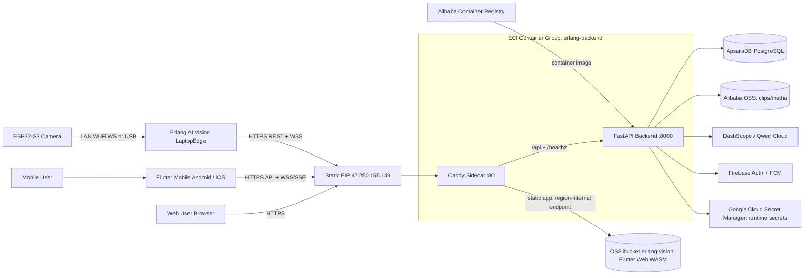

# Alibaba Cloud Architecture

Erlang AI Vision deploys the FastAPI backend on Alibaba Cloud ECI (region `ap-southeast-3`, Kuala Lumpur), stores the Flutter Web WASM build in OSS, and supports Flutter Mobile Android/iOS clients through the same public backend API. A Caddy sidecar in the same ECI container group serves the app and API on one origin behind a standing EIP; browsers never load the OSS bucket directly (see below). LaptopEdge keeps outbound connections to the backend for camera health, events, live frames, and command relay.



## Deployment Notes

- Flutter Web WASM is static output from `frontend/sentineledge_app/build/web/`, uploaded to the OSS bucket `erlang-vision` by `scripts/deployment/frontend.ps1`.
- OSS must serve `.wasm` files with `application/wasm` (the upload script sets this per file).
- OSS force-downloads HTML on the `*.aliyuncs.com` endpoint (`x-oss-force-download`), so browsers reach the app only through the Caddy sidecar, which reverse-proxies the bucket over the region-internal endpoint and strips the forced-download headers. Never place an ALB in front of OSS.
- Flutter Mobile Android/iOS is distributed separately and uses the same backend API base URL.
- FastAPI runs from the existing `backend/Dockerfile` image on ECI, pushed via ACR Personal Edition (`crpi-9kvwsegbpo7ict75.ap-southeast-3.personal.cr.aliyuncs.com`) and deployed by `scripts/deployment/backend.ps1 -Deploy` into the `erlang-backend` container group on the RDS vSwitch. Public entry is the standing EIP `erlang-eic-static-ip` (47.250.155.149).
- The Caddy sidecar routes `/api` and `/healthz` to FastAPI and reverse-proxies everything else to the OSS web bucket; it must pass WebSocket upgrades and long-lived SSE responses (the Caddyfile sets `flush_interval -1`).
- ApsaraDB PostgreSQL replaces local SQLite in production.
- `data/erlang_demo.db` is local-only and must not be deployed.

## Database Migration (SQLite -> ApsaraDB RDS PostgreSQL)

The backend reads `DATABASE_URL` (a `postgresql+asyncpg://` DSN). In production it
comes from Google Secret Manager — either a full `DATABASE_URL` key or discrete
`RDS_HOST` / `RDS_PORT` / `RDS_DB` / `RDS_USER` / `RDS_PASSWORD` keys (user/password
are URL-encoded automatically when the DSN is assembled). All datetimes are stored
UTC; clients convert for display.

One-time cutover from the local demo DB (machine IP must be in the RDS whitelist;
`DATABASE_URL` resolves from Google Secret Manager via `.env`):

```powershell
alembic -c backend\alembic.ini upgrade head
python scripts\migrate_sqlite_to_rds.py --dry-run   # rehearse, no writes
python scripts\migrate_sqlite_to_rds.py             # copy + verify, all-or-nothing
$env:APP_ENV='test'; $env:PYTHONPATH='backend'
pytest backend\tests\test_smoke_db.py -v            # validate the live instance
```

The smoke suite never drops tables against a non-SQLite target; it inserts and
removes only `*_smoketest` rows. Schema upgrades on later deploys run the same
`alembic upgrade head` as a one-off container: the image ships `alembic.ini` and
the migrations, so `docker run --rm -e ... <image> alembic upgrade head` works
before rolling the app revision.
- Alibaba OSS stores event clips, thumbnails, and future uploaded recordings.
- Google Cloud Secret Manager stores runtime secrets such as database credentials, `SESSION_SECRET_KEY`, `QWEN_API_KEY`, and Firebase Admin service-account material. The ECI runtime identity can read only `erlang-prod-secrets` and `erlang-db-secrets`; it cannot read database-superuser credentials.
- DashScope/Qwen handles cloud verification when `VERIFICATION_ENABLED=true`.
- Firebase remains the identity provider and FCM push provider.
- The Google Secret Manager reader JSON remains outside Git. Development reads that external file directly; `backend.ps1` Base64-encodes it for transport to production ECI, where the backend removes the encoded environment value after loading secrets.
