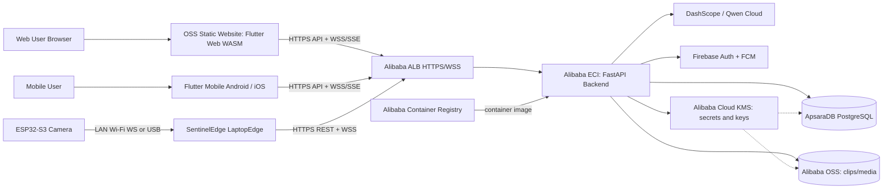

# Alibaba Cloud Architecture

SentinelEdge deploys the FastAPI backend on Alibaba Cloud ECI, serves Flutter Web WASM as static assets from OSS, and supports Flutter Mobile Android/iOS clients through the same public backend API. LaptopEdge keeps outbound connections to the backend for camera health, events, live frames, and command relay.



## Deployment Notes

- Flutter Web WASM is static output from `frontend/sentineledge_app/build/web/` and can be hosted on OSS.
- OSS must serve `.wasm` files with `application/wasm`.
- Flutter Mobile Android/iOS is distributed separately and uses the same backend API base URL.
- FastAPI runs from the existing `backend/Dockerfile` image on ECI.
- ALB must support HTTPS, WebSocket, and long-lived SSE responses.
- ApsaraDB PostgreSQL replaces local SQLite in production.
- `data/sentineledge_demo.db` is local-only and must not be deployed.

## Database Migration (SQLite -> ApsaraDB RDS PostgreSQL)

The backend reads `DATABASE_URL` (a `postgresql+asyncpg://` DSN). In production it
comes from the Alibaba KMS secret — either a full `DATABASE_URL` key or discrete
`RDS_HOST` / `RDS_PORT` / `RDS_DB` / `RDS_USER` / `RDS_PASSWORD` keys (user/password
are URL-encoded automatically when the DSN is assembled). All datetimes are stored
UTC; clients convert for display.

One-time cutover from the local demo DB (machine IP must be in the RDS whitelist;
`DATABASE_URL` resolves from the KMS secret via `.env`):

```powershell
alembic -c backend\alembic.ini upgrade head
python scripts\migrate_sqlite_to_rds.py --dry-run   # rehearse, no writes
python scripts\migrate_sqlite_to_rds.py             # copy + verify, all-or-nothing
$env:APP_ENV='test'; $env:PYTHONPATH='backend'
pytest backend\tests\test_smoke_db.py -v            # validate the live instance
```

The smoke suite never drops tables against a non-SQLite target; it inserts and
removes only `*_smoketest` rows. Schema upgrades on later deploys run the same
`alembic upgrade head` as a one-off container: the image ships `alembic.ini` and
the migrations, so `docker run --rm -e ... <image> alembic upgrade head` works
before rolling the app revision.
- Alibaba OSS stores event clips, thumbnails, and future uploaded recordings.
- Alibaba Cloud KMS stores or protects production secrets such as database credentials, `SESSION_SECRET_KEY`, `QWEN_API_KEY`, Firebase service account material, and OSS encryption keys.
- DashScope/Qwen handles cloud verification when `VERIFICATION_ENABLED=true`.
- Firebase remains the identity provider and FCM push provider.
- Secrets and service account files must be injected from KMS-backed deployment secrets or environment variables, not committed to Git.
