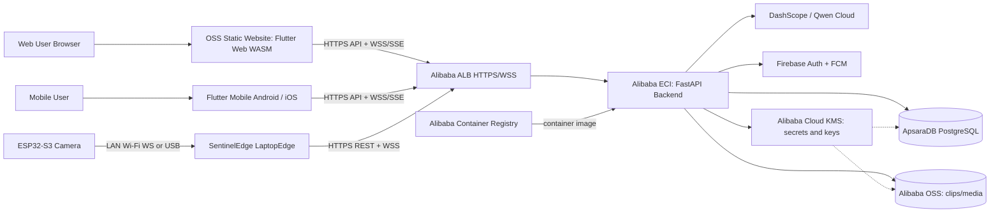

# Alibaba Cloud Architecture

SentinelEdge deploys the FastAPI backend on Alibaba Cloud ECI, serves Flutter Web WASM as static assets from OSS, and supports Flutter Mobile Android/iOS clients through the same public backend API. LaptopEdge keeps outbound connections to the backend for camera health, events, live frames, and command relay.

## Deployment Notes

- Flutter Web WASM is static output from `frontend/sentineledge_app/build/web/` and can be hosted on OSS.
- OSS must serve `.wasm` files with `application/wasm`.
- Flutter Mobile Android/iOS is distributed separately and uses the same backend API base URL.
- FastAPI runs from the existing `backend/Dockerfile` image on ECI.
- ALB must support HTTPS, WebSocket, and long-lived SSE responses.
- ApsaraDB PostgreSQL replaces local SQLite in production.
- `data/sentineledge_demo.db` is local-only and must not be deployed.
- Alibaba OSS stores event clips, thumbnails, and future uploaded recordings.
- Alibaba Cloud KMS stores or protects production secrets such as database credentials, `SESSION_SECRET_KEY`, `QWEN_API_KEY`, Firebase service account material, and OSS encryption keys.
- DashScope/Qwen handles cloud verification when `VERIFICATION_ENABLED=true`.
- Firebase remains the identity provider and FCM push provider.
- Secrets and service account files must be injected from KMS-backed deployment secrets or environment variables, not committed to Git.
